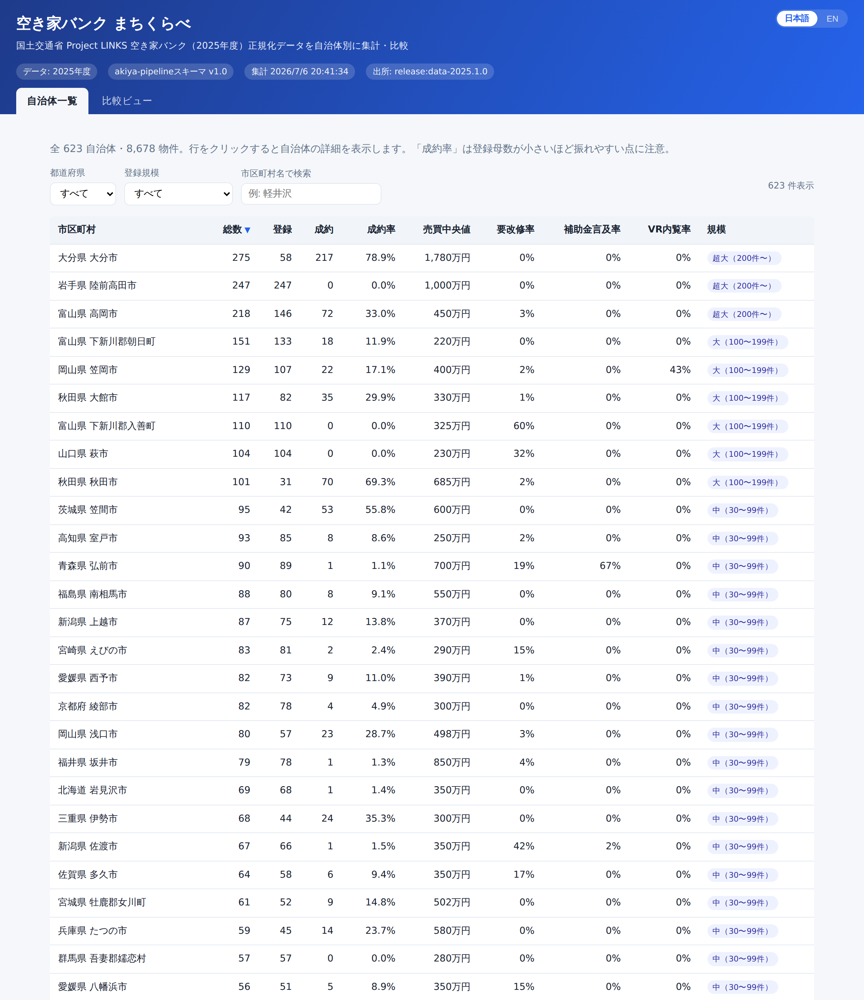
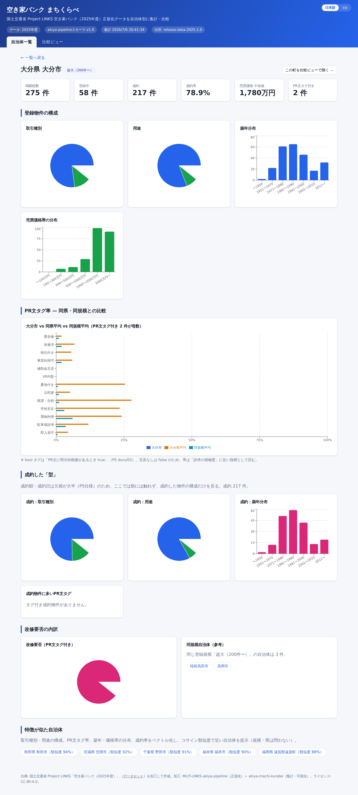
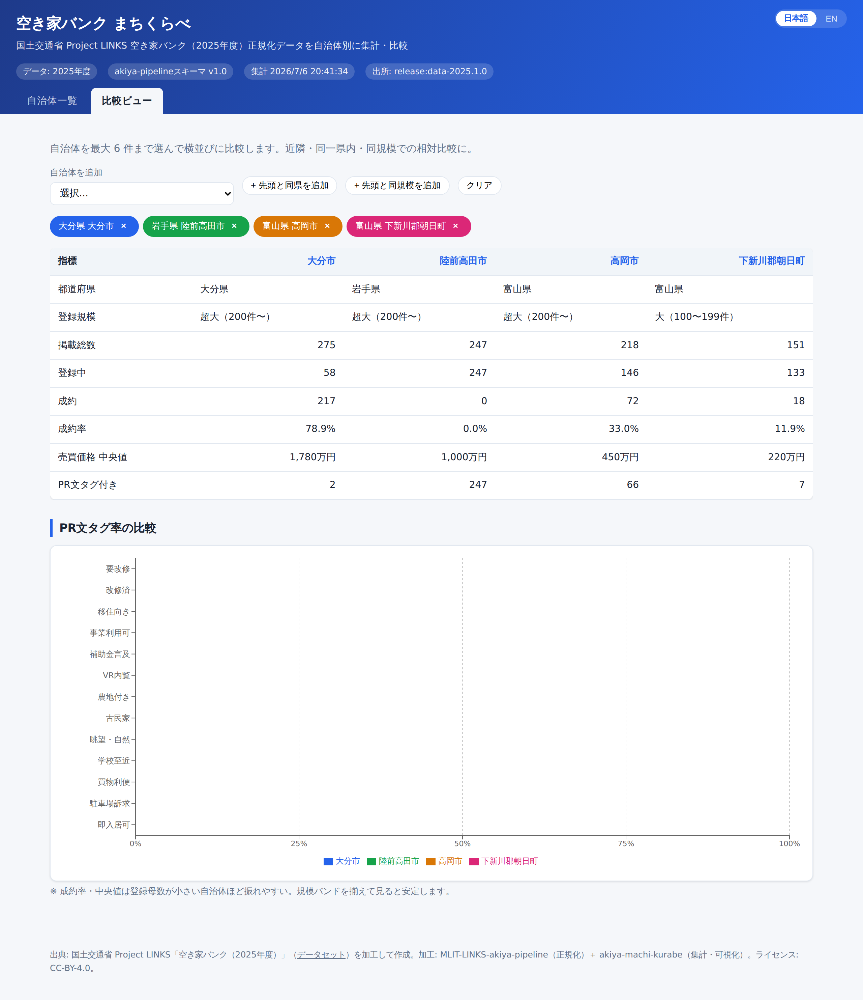

# 空き家バンク まちくらべ

**全国の自治体の「空き家バンク」を、町ごとに俯瞰・比較できる Web ダッシュボード**です。
国土交通省 Project LINKS が公開する空き家バンクのオープンデータを、自治体（市区町村）単位で
集計・可視化します。登録数・成約率・価格帯・物件の特徴などを、近隣や同規模の自治体と並べて比較できます。

🔗 **デモ:** https://shinyanakashima.github.io/MLIT-LINKS-akiya-machi-kurabe/

> **現在のデータ**: 国土交通省 Project LINKS の空き家バンク**実データ**（`data-2025.1.0`、2025 年度・全国 623 自治体 / 8,678 物件）を反映しています。
> （上流データを取得できないビルドでは、スキーマ準拠の**決定的な合成サンプル**に自動でフォールバックし、その場合のみ画面上部に「⚠ 合成サンプルデータ」と表示します。）

---

## これは何のためのもの？

空き家バンクは多くの自治体が個別に運用しており、「自分の町の登録・成約状況が他と比べてどうなのか」を
横断的に見る手段がありませんでした。本ツールは、各自治体の担当者や地域政策の企画担当が次のことを行えるよう設計しています。

- 自地域の登録・成約状況を把握し、**近隣／類似規模の自治体と比較**する
- 改修要否率・補助金言及率など、物件 PR 文から得た指標で**施策のヒント**を得る
- 自地域で「**どんな型の物件が成約しやすいか**」を掴む

想定利用者: 自治体の空き家・移住定住担当、地域政策の企画担当、オープンデータ活用に関心のある開発者・研究者。

## 主な機能

- **自治体一覧** — 全自治体を表で俯瞰。都道府県・登録規模・名称で絞り込み、各指標で並び替え。
- **自治体詳細** — 取引種別／用途／築年／価格帯の構成、PR 文 12 タグ率の「同県平均・同規模平均」との比較、
  成約した物件の「型」、改修要否の内訳、**特徴が似た自治体**（コサイン類似度）。
- **比較ビュー** — 最大 6 自治体を横並びで比較。「同県を追加」「同規模を追加」のワンクリックプリセット付き。
- **日本語 / 英語の切替** — 画面右上のトグルで全 UI を切替（既定は日本語、選択はブラウザに保存）。
- **インストール不要** — サーバや DB を持たない静的サイト。ブラウザだけで動作します。

## 画面イメージ

| 自治体一覧 | 自治体詳細 | 比較ビュー |
| --- | --- | --- |
| [](docs/img/overview.png) | [](docs/img/municipality.png) | [](docs/img/compare.png) |

<sub>※ クリックで拡大。画面は実データ（2025 年度）です。</sub>

## データの流れ（全体像）

本ツール単体ではデータ収集や正規化を行いません。**別リポジトリのパイプラインが正規化した
オープンデータを入力**として受け取り、自治体別に再集計して描画することに専念します。

```
国土交通省 Project LINKS「空き家バンク」オープンデータ
        │
        ▼
 MLIT-LINKS-akiya-pipeline  … データの取得・正規化を担うリポジトリ（本ツールの上流）
   （正規化済み JSON を GitHub Releases で配布）
        │  ビルド時に取得（scripts/fetch-data.mjs）
        ▼
 MLIT-LINKS-akiya-machi-kurabe（本リポジトリ）
   集計（scripts/aggregate.ts）→ public/data/*.json として焼き込み
        │
        ▼
 Vite + React + Recharts でビルド → GitHub Pages で公開
```

- 上流パイプライン: [**MLIT-LINKS-akiya-pipeline**](https://github.com/shinyanakashima/MLIT-LINKS-akiya-pipeline)
  （リポジトリ内では略称 **P5** と表記）。正規化はこのパイプラインの責務であり、**本リポジトリでは再実装しません**。
- **実行時 API なし** — 集計はビルド時に一度だけ実行し、結果を静的 JSON として `public/data/` に保存します。
- **データベース不要** — GitHub Actions が「取得 → 集計 → ビルド → 公開」を自動で行います。

### 生成される集計データ（`public/data/`）

| ファイル | 内容 |
| --- | --- |
| `manifest.json` | 件数・スキーマ版・出所・ライセンス・規模バンド定義・タグ軸ラベル |
| `municipalities.json` | 全自治体の軽量サマリ（一覧・比較ビュー用） |
| `municipalities/<id>.json` | 自治体ごとの詳細（築年・価格帯ヒストグラム、成約プロファイル等） |
| `prefectures.json` | 都道府県ロールアップ（同県平均の基準値） |

集計データの型定義は [`src/types/aggregates.ts`](src/types/aggregates.ts) が正準です。
集計の計算方法（成約率・タグ率の母数、規模バンド、「似た自治体」の判定など）は
[**docs/ALGORITHM.md**](docs/ALGORITHM.md) を参照してください。

## 元データから使う項目

上流パイプラインが出力する正規化スキーマのうち、本ツールが**実際に参照する**のは以下に限られます
（型は [`src/types/p5.ts`](src/types/p5.ts)）。

| フィールド | 用途 |
| --- | --- |
| `location.prefecture` / `location.city` | 自治体の集計キー |
| `status`（登録 / 成約） | 登録・成約の件数、成約率 |
| `deal_type` / `use_type` | 取引種別・用途の構成 |
| `price_yen`（売買） | 価格帯分布・中央値 |
| `building.construction_year` | 築年分布 |
| `tags.labels`（12 軸） | 改修要否率・補助金言及率・VR 内覧率などの自治体別集計 |
| `contract` の有無 | 成約した「型」の把握（額・日付は使用しない） |

自由記述系の項目（設備・周辺距離・土地・アクセス等）は欠損が多いため使用しません。

## 既知の制約

本ツールの理想に対し、元データの制約で現状できないこと。いずれもデータ由来の制約で、上流パイプラインでも
将来課題として整理されています。

- **人口データが無い** → 人口規模での正確な比較ができないため、暫定的に**登録総数を規模の代理指標**
  （規模バンド XS〜XL）として用いています。本格的な人口規模比較には外部の人口統計（e-Stat 等）の付与が必要です。
- **緯度経度が無い** → 地理的距離で「近隣」を測れないため、暫定的に**同一県内**を近接の代理として用いています。
- **成約日・成約額が高欠損**（約 9 割）→ 成約は「型（構成）」の把握にとどめ、**金額の分析は行いません**。

## 数値の読み方

数値を解釈する際は、以下の前提に注意してください。

- **成約率** = 成約 ÷ 掲載総数。**登録母数が小さい自治体ほど振れやすい**ため、規模バンドを揃えて比較すると安定します。
- **PR 文タグ率** は「PR 文に明示的な根拠があるときのみ true」として集計しています。言及が無ければ false 扱いのため、率は実態というより**「その特徴をどれだけ積極的に訴求しているか」**に近い指標です。
- **登録規模（規模バンド）** は人口ではなく**登録総数の代理指標**です。人口規模の比較ではありません。
- **売買価格 中央値** は売買物件のみが対象です（賃貸は含みません）。
- **成約した「型」** は金額に触れず、取引種別・用途・築年などの**構成だけ**を見ます（成約額・成約日が高欠損のため）。
- データはすべて**申請（登録）ベース**であり、正式な品質検証を経たものではありません。

## 用語集

| 用語 | 意味 |
| --- | --- |
| 掲載総数 | その自治体の空き家バンク登録物件の総件数 |
| 登録（中） | 現在も募集中（成約していない）の件数 |
| 成約 | 取引が成立した件数 |
| 成約率 | 成約 ÷ 掲載総数 |
| 登録規模 / 規模バンド | 登録総数を 5 段階（XS〜XL）に区分した代理指標。人口規模ではない |
| PR 文タグ（12 軸） | 物件の PR 文から抽出した特徴フラグ（要改修・補助金言及・VR 内覧 など） |
| 改修要否 | 物件が要改修／改修済／現状渡し／不明のいずれかの内訳 |
| 同県平均 / 同規模平均 | 比較の基準値。同一県内、または同じ規模バンドの自治体平均 |
| 成約した「型」 | 成約物件に多い取引種別・用途・築年などの傾向 |
| 合成サンプルデータ | 上流データを取得できない時に用いる、スキーマ準拠の仮データ（数値に実質的意味はない） |

## 開発手順

前提: Node.js 20 以上。

```bash
npm install
npm run dev      # データ生成 → 開発サーバ起動（http://localhost:5173）
```

`npm run dev` / `npm run build` は実行前に自動でデータを用意します（取得 → 集計）。
上流リリースを取得できない環境（オフラインやネットワーク制限下）では、**スキーマ準拠の合成サンプル**
（`scripts/gen-fixture.mjs`、決定的に生成）へ自動でフォールバックするため、開発・デモを止めません。

| コマンド | 内容 |
| --- | --- |
| `npm run data` | 元データ取得（失敗時は合成サンプル）→ 集計して `public/data` へ |
| `npm run fixture` | 合成サンプルのみ生成 |
| `npm test` | 集計ロジックの単体テスト |
| `npm run lint` | 型チェック（`tsc`） |
| `npm run build` | 本番ビルド（`dist/`） |

### 実データを取得する

`scripts/fetch-data.mjs` が上流パイプラインの GitHub Releases から正規化済み JSON を取得します。

```bash
# 特定リリースに固定（本番推奨：タグでピン留め）
RELEASE_TAG=data-2025.1.0 npm run data

# 取得せず合成サンプルを使う
USE_FIXTURE=1 npm run data
```

## デプロイ（GitHub Pages）

- `.github/workflows/deploy.yml` — `main` への push / 手動実行 / 年次スケジュールで、取得 → 集計 → ビルド → Pages 公開。
- `.github/workflows/ci.yml` — PR・push 時に型チェック・テスト・合成データでのビルド検証。
- GitHub Pages のサブパス配信に合わせ、`vite.config.ts` の `base` を `/MLIT-LINKS-akiya-machi-kurabe/` に設定しています。
  別ホスティングへ出す場合は `BASE_PATH=/ npm run build` で上書きできます。

> 初回のみ、リポジトリの **Settings → Pages → Build and deployment → Source** を「GitHub Actions」に設定してください。

## ライセンス・出典

出典: 国土交通省 Project LINKS「空き家バンク」を加工して作成。
加工: MLIT-LINKS-akiya-pipeline（正規化）＋ MLIT-LINKS-akiya-machi-kurabe（集計・可視化）。
ライセンス: **CC-BY 4.0**。詳細は [ATTRIBUTION.md](ATTRIBUTION.md) を参照してください。

---

<sub>本リポジトリは旧 `MLIT-LINKS-akiya-survey` の後継です。正規化を上流パイプラインに委ね、集計・可視化に特化しました。</sub>
